# Templar Architecture Documentation

This document provides comprehensive architecture documentation for Templar, including high-level system architecture, component relationships, data flows, and key workflows with professional diagrams.

## Table of Contents

- [System Overview](#system-overview)
- [High-Level Architecture](#high-level-architecture)
- [Package Architecture](#package-architecture)
- [Core Component Interactions](#core-component-interactions)
- [Key Workflows](#key-workflows)
- [Data Flow Diagrams](#data-flow-diagrams)
- [Security Architecture](#security-architecture)
- [Performance Architecture](#performance-architecture)
- [Deployment Architecture](#deployment-architecture)

## System Overview

Templar is a rapid prototyping CLI tool for Go templ components that provides browser preview functionality, hot reload capability, and streamlined development workflows. The system is designed with a modular, event-driven architecture that prioritizes security, performance, and developer experience.

### Core Principles

- **Safety**: Defense-in-depth security with input validation, command injection prevention, and race condition protection
- **Performance**: Optimized for 30M+ operations/second with concurrent processing, object pooling, and lock-free operations
- **Developer Experience**: Clean interfaces, comprehensive testing, and zero technical debt policy

## High-Level Architecture

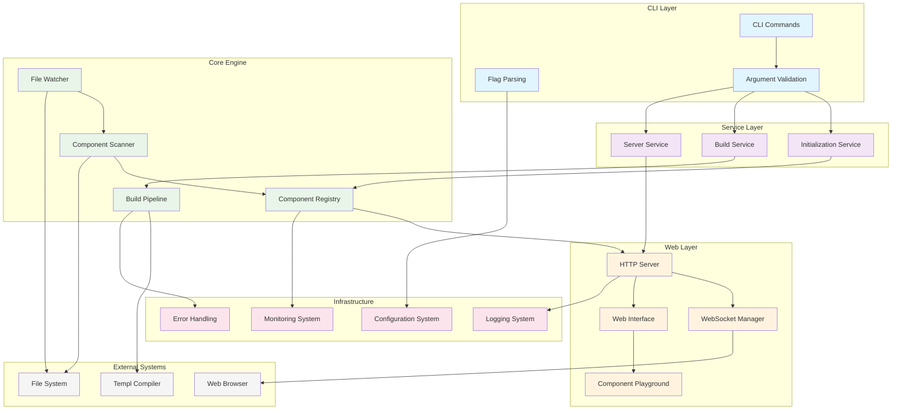

## Package Architecture

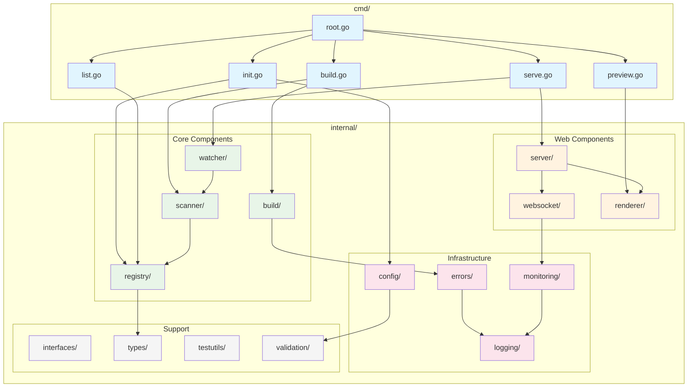

## Core Component Interactions

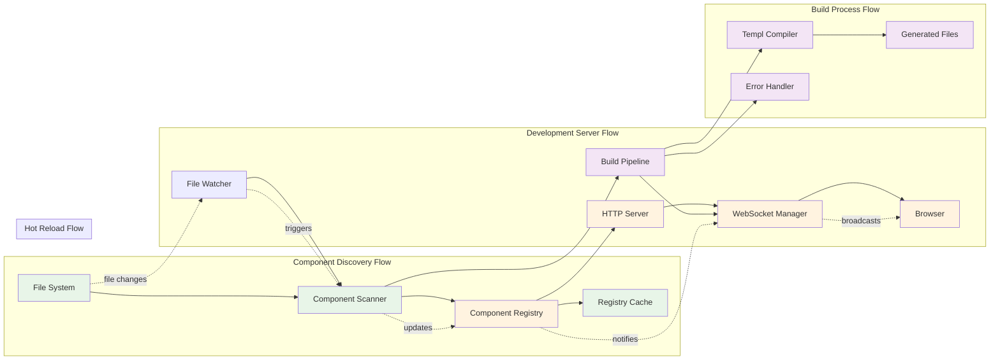

## Key Workflows

### 1. Project Initialization Workflow

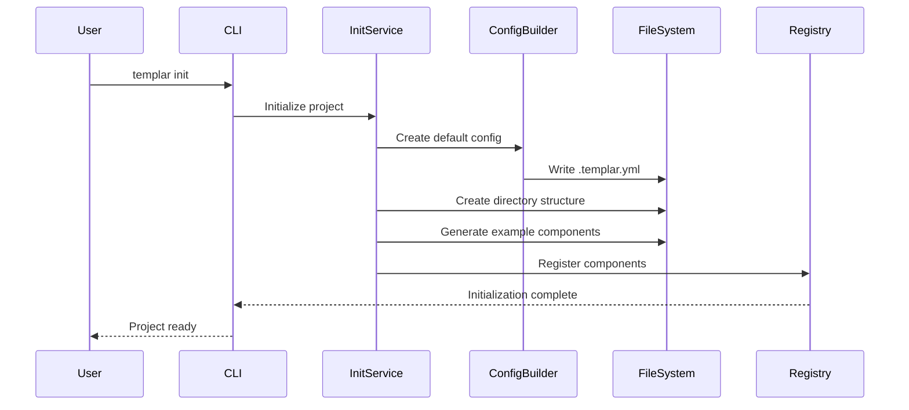

### 2. Development Server Startup Workflow

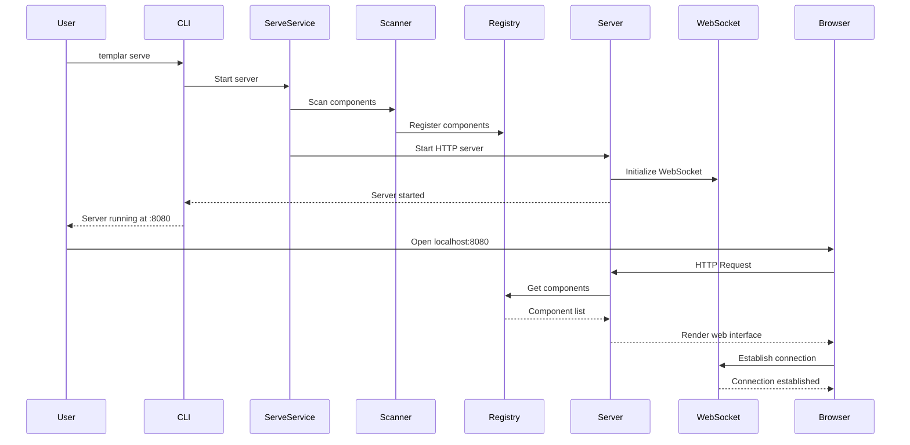

### 3. Hot Reload Workflow

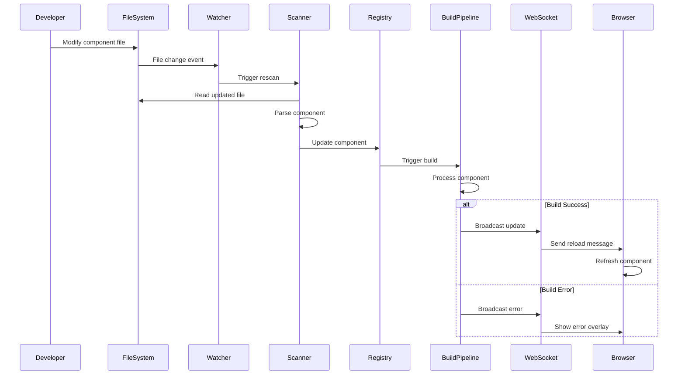

### 4. Component Build Workflow

```mermaid
sequenceDiagram
    participant CLI
    participant BuildService
    participant Scanner
    participant Registry
    participant Pipeline
    parameter Workers as Worker Pool
    participant TemplCompiler
    participant Cache
    participant ErrorHandler

    CLI->>BuildService: Build components
    BuildService->>Scanner: Scan for components
    Scanner->>Registry: Register components
    BuildService->>Pipeline: Start build
    Pipeline->>Workers: Distribute tasks
    
    par Worker Processing
        Workers->>Cache: Check cache
        alt Cache Hit
            Cache-->>Workers: Return cached result
        else Cache Miss
            Workers->>TemplCompiler: Compile component
            TemplCompiler-->>Workers: Compilation result
            Workers->>Cache: Store result
        end
    end
    
    Workers->>Pipeline: Collect results
    
    alt All Success
        Pipeline-->>BuildService: Build complete
        BuildService-->>CLI: Success
    else Errors Occurred
        Pipeline->>ErrorHandler: Process errors
        ErrorHandler-->>BuildService: Error report
        BuildService-->>CLI: Build failed
    end
```

## Data Flow Diagrams

### Component Discovery Data Flow

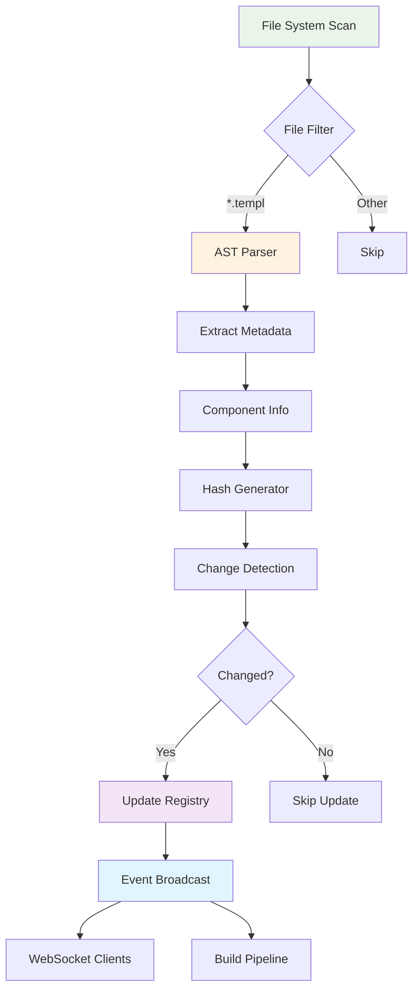

### WebSocket Communication Data Flow

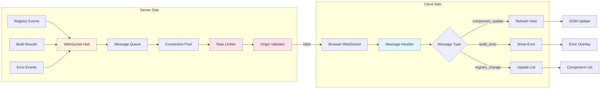

## Security Architecture

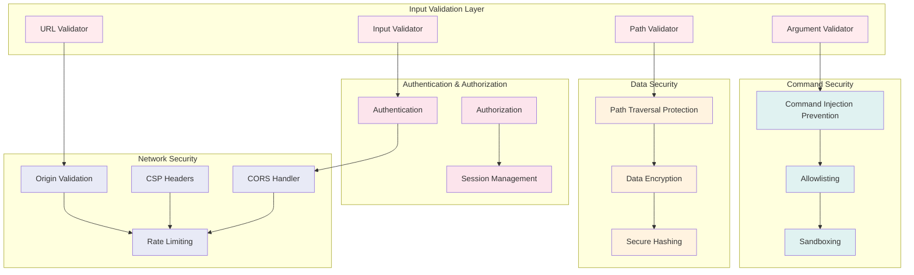

## Performance Architecture

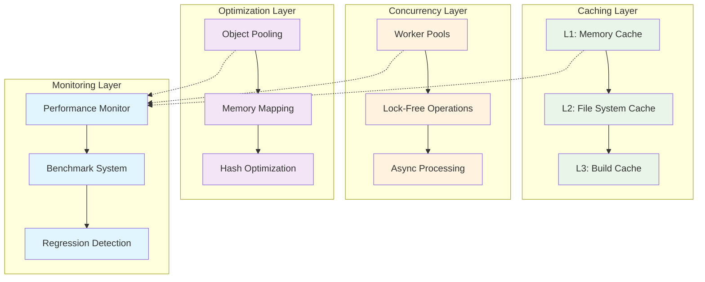

## Deployment Architecture

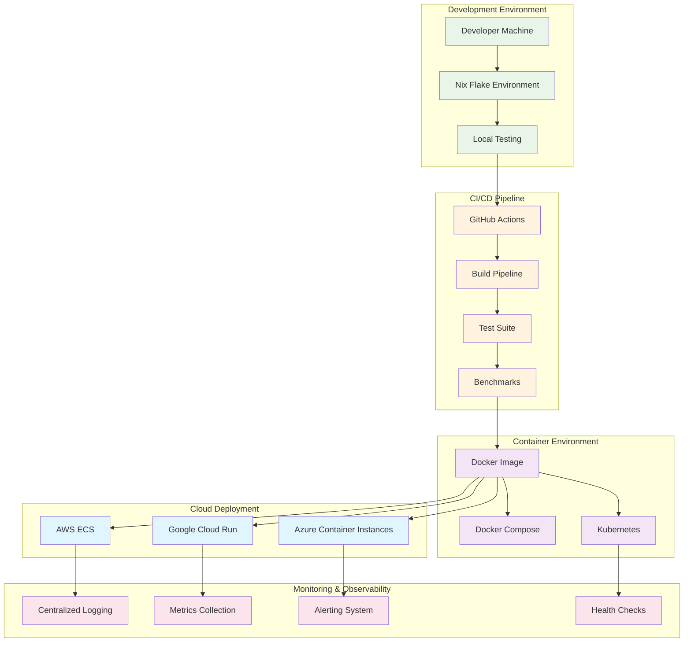

## Architecture Principles

### Interface-Driven Design

The system follows interface-driven design principles with clean abstractions:

- **ComponentRegistry**: Thread-safe component management with change notifications
- **ComponentScanner**: Parallel component discovery and analysis
- **BuildPipeline**: Configurable worker pools with caching and error handling
- **FileFilter**: Flexible file filtering for scanning and watching

### Event-Driven Architecture

Components communicate through events to maintain loose coupling:

- Registry broadcasts component changes
- File watcher triggers scanner updates
- Build pipeline emits completion events
- WebSocket manager distributes real-time updates

### Security-First Design

Security is built into every layer:

- Input validation at all entry points
- Command injection prevention with strict allowlisting
- Path traversal protection with directory enforcement
- WebSocket origin validation with CSRF protection
- Rate limiting and connection management

### Performance Optimization

The system is optimized for high performance:

- **30M+ operations/second** with concurrent processing
- **Object pooling** for memory optimization
- **Lock-free operations** where possible
- **Multi-level caching** with LRU eviction
- **Memory mapping** for large file operations

## Maintenance and Updates

### Diagram Maintenance Process

1. **Automatic Updates**: Diagrams should be updated when major architectural changes occur
2. **Review Process**: All diagram changes require architectural review
3. **Version Control**: Diagrams are version controlled alongside code
4. **Documentation Sync**: Keep diagrams synchronized with implementation
5. **Regular Audits**: Quarterly reviews to ensure diagrams reflect current architecture

### Tools and Standards

- **Mermaid**: Primary diagramming tool for consistency and maintainability
- **GitHub Integration**: Diagrams render automatically in GitHub
- **PlantUML Alternative**: Fallback option for complex diagrams
- **Architecture Decision Records**: Document architectural changes

### Contributing to Architecture

When making architectural changes:

1. Update relevant diagrams first
2. Document the change rationale
3. Review impact on existing components
4. Update this documentation
5. Ensure zero technical debt policy compliance

---

*This documentation is maintained as part of the zero technical debt policy. Last updated: 2025-07-29*