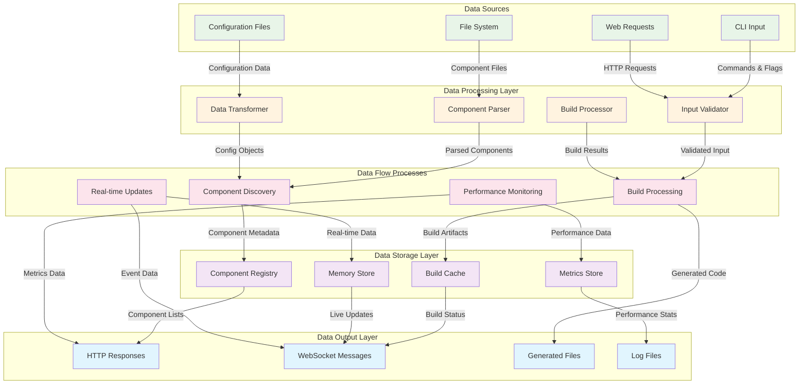
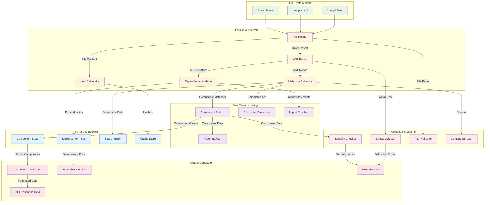
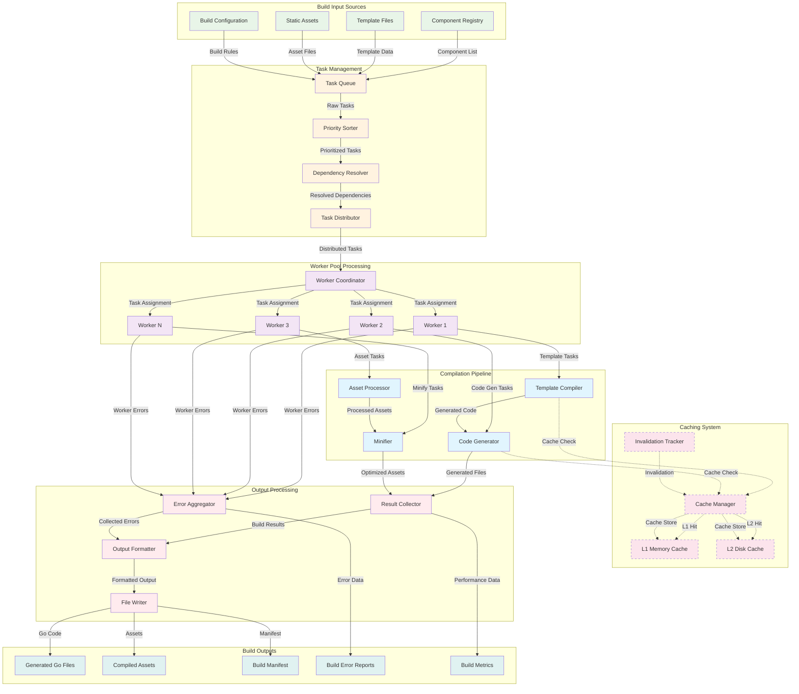
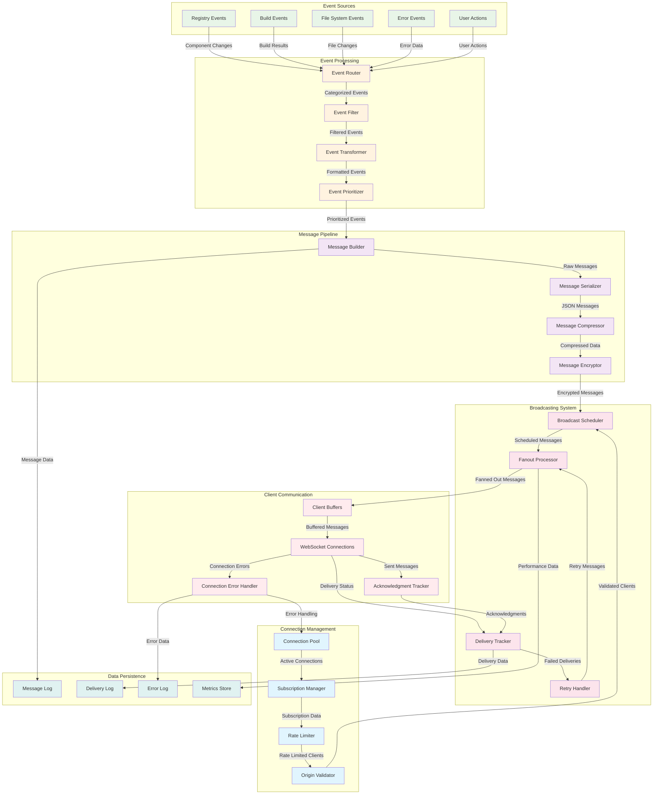
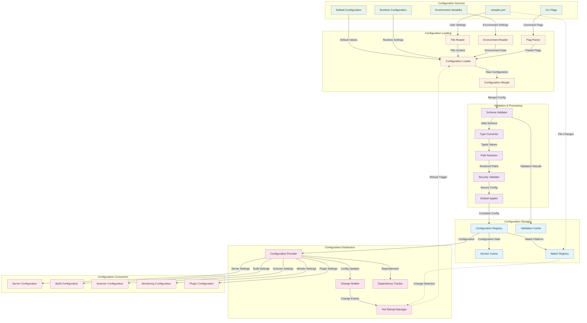
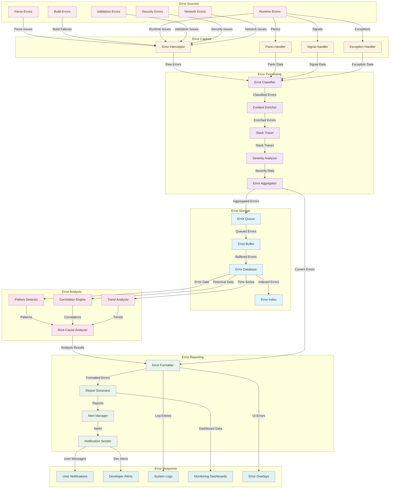
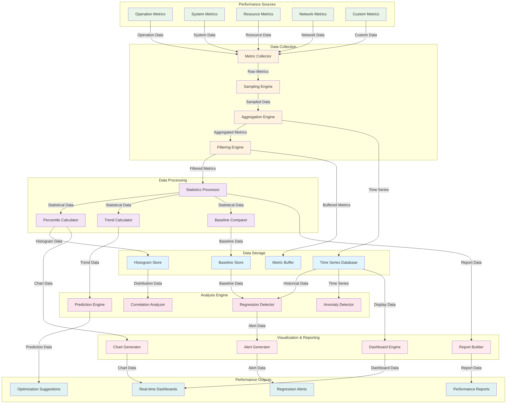
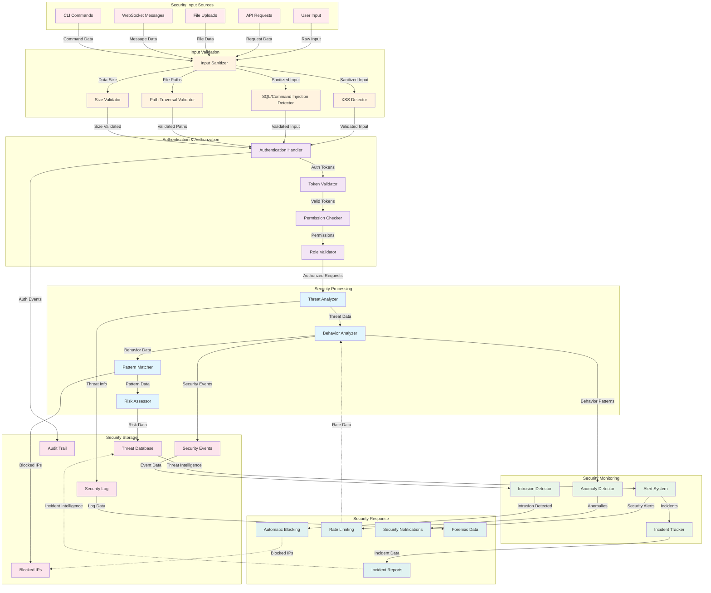

# Data Flow Diagrams Documentation

This document provides comprehensive data flow diagrams showing how data moves through the Templar system, including data transformations, storage, and processing flows.

## Table of Contents

- [Overview](#overview)
- [High-Level Data Flow](#high-level-data-flow)
- [Component Data Processing Flow](#component-data-processing-flow)
- [Build Pipeline Data Flow](#build-pipeline-data-flow)
- [WebSocket Data Flow](#websocket-data-flow)
- [Configuration Data Flow](#configuration-data-flow)
- [Error Data Flow](#error-data-flow)
- [Performance Data Flow](#performance-data-flow)
- [Security Data Flow](#security-data-flow)

## Overview

Data flow diagrams (DFDs) show how data moves through the Templar system, illustrating data sources, transformations, storage, and destinations. These diagrams help understand data lifecycle and identify potential bottlenecks or security concerns.

## High-Level Data Flow

## Component Data Processing Flow

## Build Pipeline Data Flow

## WebSocket Data Flow

## Configuration Data Flow

## Error Data Flow

## Performance Data Flow

## Security Data Flow

## Data Flow Optimization Guidelines

### 1. Data Flow Performance

- **Minimize Data Transformations**: Reduce unnecessary data conversions
- **Use Streaming**: Process data in streams where possible
- **Implement Caching**: Cache frequently accessed data
- **Optimize Serialization**: Use efficient serialization formats

### 2. Data Flow Security

- **Validate at Boundaries**: Validate data at system boundaries
- **Encrypt Sensitive Data**: Encrypt sensitive data in transit and at rest
- **Audit Data Access**: Log all data access operations
- **Implement Data Loss Prevention**: Prevent sensitive data leakage

### 3. Data Flow Monitoring

- **Track Data Volume**: Monitor data volume and throughput
- **Measure Latency**: Track data processing latency
- **Monitor Quality**: Validate data quality and integrity
- **Alert on Anomalies**: Alert on unusual data patterns

### 4. Data Flow Maintenance

- **Regular Reviews**: Review data flows quarterly
- **Update Documentation**: Keep diagrams current with implementation
- **Performance Testing**: Regularly test data flow performance
- **Capacity Planning**: Plan for data growth and scaling

---

*These data flow diagrams provide comprehensive views of how data moves through the Templar system. They should be updated whenever significant changes are made to data processing or storage. Last updated: 2025-07-29*