# Package Dependencies Documentation

This document provides detailed package dependency graphs and dependency analysis for the Templar project.

## Table of Contents

- [Overview](#overview)
- [Complete Package Dependency Graph](#complete-package-dependency-graph)
- [Layer-by-Layer Dependencies](#layer-by-layer-dependencies)
- [Circular Dependencies Analysis](#circular-dependencies-analysis)
- [External Dependencies](#external-dependencies)
- [Dependency Metrics](#dependency-metrics)

## Overview

Templar follows a layered architecture with clear dependency directions to prevent circular dependencies and maintain clean separation of concerns. The dependency graph shows how packages depend on each other and helps identify potential architectural issues.

## Complete Package Dependency Graph

```mermaid
graph TD
    subgraph "CLI Layer (cmd/)"
        ROOT[cmd/root.go]
        INIT[cmd/init.go]
        SERVE[cmd/serve.go]
        BUILD[cmd/build.go]
        LIST[cmd/list.go]
        PREVIEW[cmd/preview.go]
        WATCH[cmd/watch.go]
        FLAGS[cmd/flags.go]
        VALIDATE[cmd/validate.go]
    end

    subgraph "Service Layer (internal/services/)"
        SVC_INIT[services/init.go]
        SVC_BUILD[services/build.go]
        SVC_SERVE[services/serve.go]
    end

    subgraph "Core Business Logic"
        REG[registry/component.go]
        SCAN[scanner/scanner.go]
        WATCH_PKG[watcher/watcher.go]
        BUILD_PKG[build/pipeline.go]
        RENDER[renderer/renderer.go]
    end

    subgraph "Server Layer (internal/server/)"
        SERVER[server/server.go]
        HANDLERS[server/handlers.go]
        WS[server/websocket.go]
        WS_MANAGER[server/websocket_manager.go]
        WS_OPT[server/websocket_optimized.go]
        ROUTER[server/http_router.go]
        MIDDLEWARE[server/middleware_chain.go]
        SECURITY[server/security.go]
        RATELIMIT[server/ratelimit.go]
    end

    subgraph "Infrastructure Layer"
        CONFIG[config/config.go]
        ERRORS[errors/errors.go]
        LOGGING[logging/logger.go]
        MONITOR[monitoring/monitor.go]
        METRICS[monitoring/metrics.go]
        PERF[performance/monitor.go]
    end

    subgraph "Support Packages"
        INTERFACES[interfaces/core.go]
        TYPES[types/component.go]
        VALIDATION[validation/security.go]
        TESTUTILS[testutils/helpers.go]
    end

    subgraph "Plugin System"
        PLUGINS[plugins/manager.go]
        PLUGIN_BUILTIN[plugins/builtin/]
        PLUGIN_CSS[plugins/css/]
    end

    subgraph "External Dependencies"
        COBRA[github.com/spf13/cobra]
        VIPER[github.com/spf13/viper]
        WEBSOCKET_LIB[github.com/coder/websocket]
        TESTIFY[github.com/stretchr/testify]
        FSNOTIFY[github.com/fsnotify/fsnotify]
    end

    %% CLI Dependencies
    ROOT --> FLAGS
    ROOT --> CONFIG
    ROOT --> COBRA
    
    INIT --> SVC_INIT
    SERVE --> SVC_SERVE
    BUILD --> SVC_BUILD
    LIST --> REG
    PREVIEW --> RENDER
    WATCH --> WATCH_PKG
    
    FLAGS --> VALIDATION
    VALIDATE --> VALIDATION

    %% Service Dependencies
    SVC_INIT --> CONFIG
    SVC_INIT --> REG
    SVC_INIT --> ERRORS
    
    SVC_BUILD --> BUILD_PKG
    SVC_BUILD --> SCAN
    SVC_BUILD --> ERRORS
    
    SVC_SERVE --> SERVER
    SVC_SERVE --> WATCH_PKG
    SVC_SERVE --> REG

    %% Core Business Logic Dependencies
    REG --> TYPES
    REG --> ERRORS
    REG --> MONITOR
    
    SCAN --> REG
    SCAN --> TYPES
    SCAN --> ERRORS
    SCAN --> FSNOTIFY
    
    WATCH_PKG --> SCAN
    WATCH_PKG --> FSNOTIFY
    WATCH_PKG --> ERRORS
    
    BUILD_PKG --> TYPES
    BUILD_PKG --> ERRORS
    BUILD_PKG --> MONITOR
    
    RENDER --> TYPES
    RENDER --> ERRORS

    %% Server Dependencies
    SERVER --> HANDLERS
    SERVER --> WS_MANAGER
    SERVER --> ROUTER
    SERVER --> MIDDLEWARE
    SERVER --> CONFIG
    SERVER --> LOGGING
    
    HANDLERS --> REG
    HANDLERS --> RENDER
    HANDLERS --> TYPES
    HANDLERS --> ERRORS
    
    WS --> WS_MANAGER
    WS --> WEBSOCKET_LIB
    WS --> ERRORS
    
    WS_MANAGER --> WS_OPT
    WS_MANAGER --> MONITOR
    WS_MANAGER --> SECURITY
    
    WS_OPT --> WEBSOCKET_LIB
    
    ROUTER --> MIDDLEWARE
    ROUTER --> SECURITY
    
    MIDDLEWARE --> RATELIMIT
    MIDDLEWARE --> LOGGING
    MIDDLEWARE --> SECURITY
    
    SECURITY --> VALIDATION
    SECURITY --> ERRORS
    
    RATELIMIT --> MONITOR
    RATELIMIT --> CONFIG

    %% Infrastructure Dependencies
    CONFIG --> VIPER
    CONFIG --> VALIDATION
    CONFIG --> ERRORS
    
    ERRORS --> TYPES
    
    LOGGING --> CONFIG
    
    MONITOR --> METRICS
    MONITOR --> LOGGING
    MONITOR --> CONFIG
    
    METRICS --> PERF
    
    PERF --> CONFIG

    %% Support Package Dependencies
    INTERFACES --> TYPES
    
    VALIDATION --> ERRORS
    
    TESTUTILS --> TESTIFY
    TESTUTILS --> TYPES
    TESTUTILS --> CONFIG

    %% Plugin Dependencies
    PLUGINS --> INTERFACES
    PLUGINS --> CONFIG
    PLUGINS --> ERRORS
    
    PLUGIN_BUILTIN --> PLUGINS
    PLUGIN_CSS --> PLUGINS

    classDef cli fill:#e1f5fe
    classDef service fill:#f3e5f5
    classDef core fill:#e8f5e8
    classDef server fill:#fff3e0
    classDef infra fill:#fce4ec
    classDef support fill:#f5f5f5
    classDef plugin fill:#e0f2f1
    classDef external fill:#ffebee

    class ROOT,INIT,SERVE,BUILD,LIST,PREVIEW,WATCH,FLAGS,VALIDATE cli
    class SVC_INIT,SVC_BUILD,SVC_SERVE service
    class REG,SCAN,WATCH_PKG,BUILD_PKG,RENDER core
    class SERVER,HANDLERS,WS,WS_MANAGER,WS_OPT,ROUTER,MIDDLEWARE,SECURITY,RATELIMIT server
    class CONFIG,ERRORS,LOGGING,MONITOR,METRICS,PERF infra
    class INTERFACES,TYPES,VALIDATION,TESTUTILS support
    class PLUGINS,PLUGIN_BUILTIN,PLUGIN_CSS plugin
    class COBRA,VIPER,WEBSOCKET_LIB,TESTIFY,FSNOTIFY external
```

## Layer-by-Layer Dependencies

### Layer 1: Support and Foundation

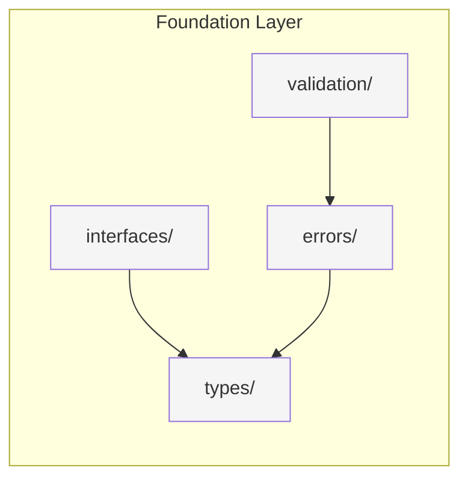

### Layer 2: Infrastructure

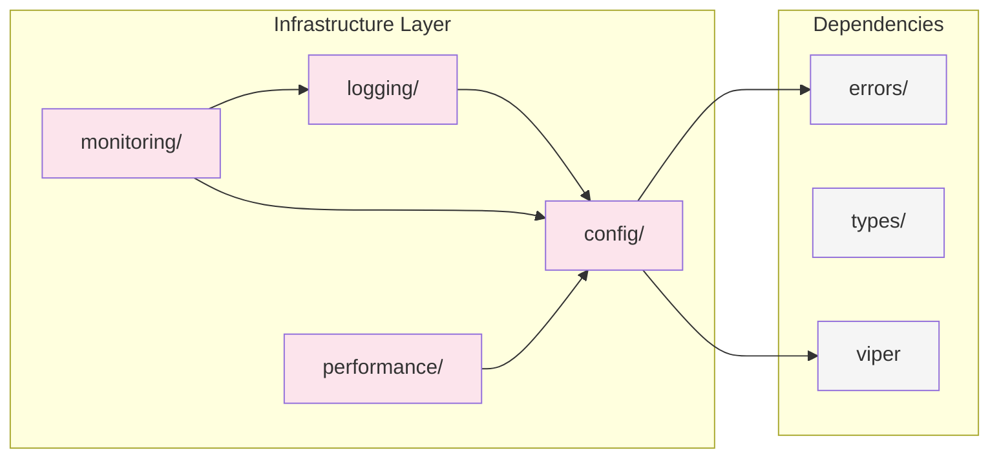

### Layer 3: Core Business Logic

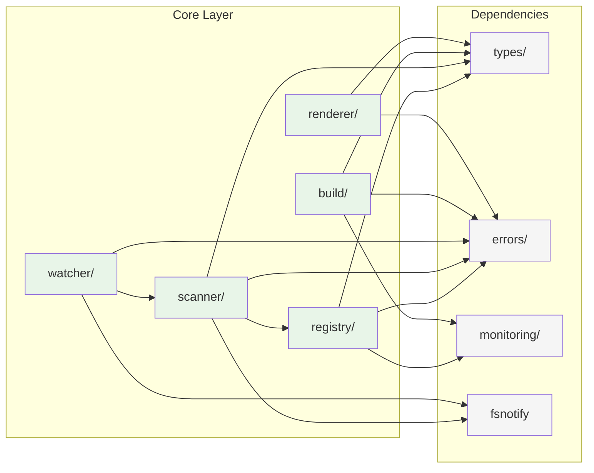

### Layer 4: Server and Plugin Layer

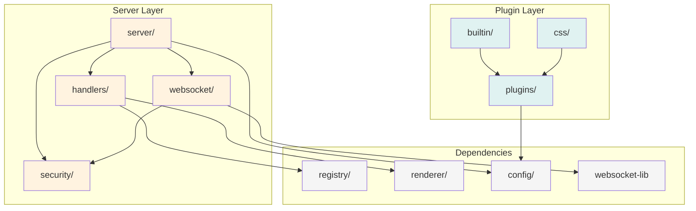

### Layer 5: Service and CLI Layer

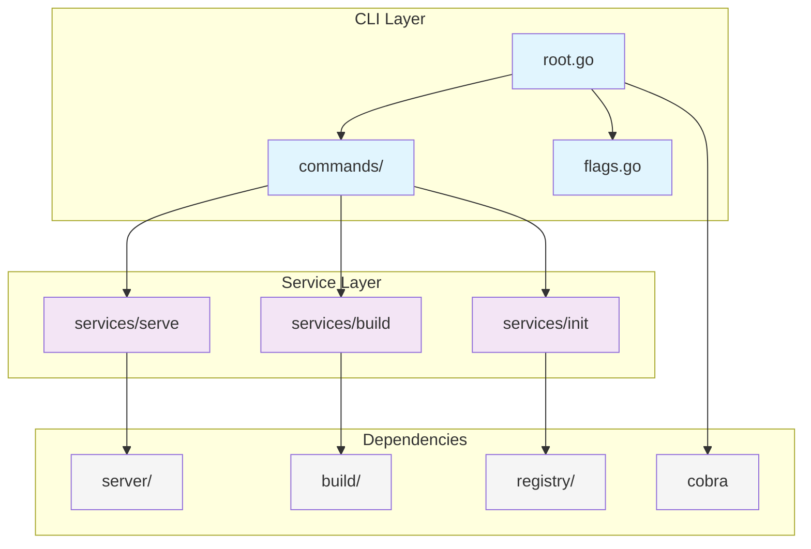

## Circular Dependencies Analysis

### Current Status: ✅ No Circular Dependencies

The architecture has been designed to prevent circular dependencies through strict layering:

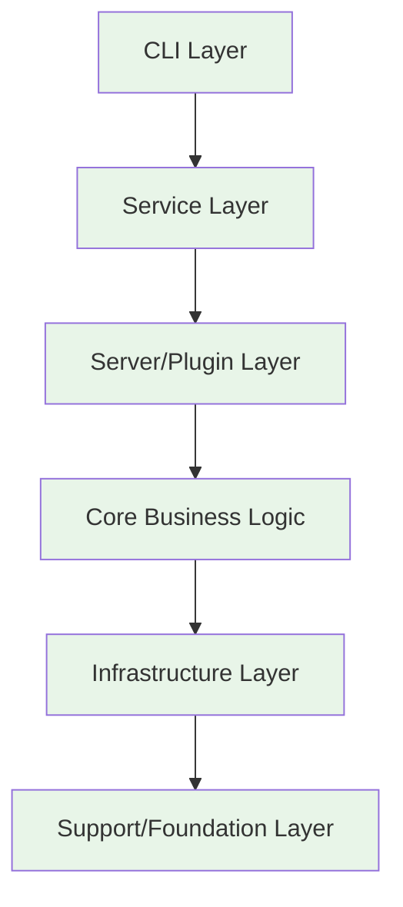

### Dependency Rules

1. **Downward Dependencies Only**: Higher layers can depend on lower layers, never upward
2. **No Horizontal Dependencies**: Packages within the same layer should not depend on each other
3. **Interface-Based Coupling**: Use interfaces to break direct dependencies when needed
4. **Event-Driven Communication**: Use events for cross-layer communication

### Potential Risk Areas

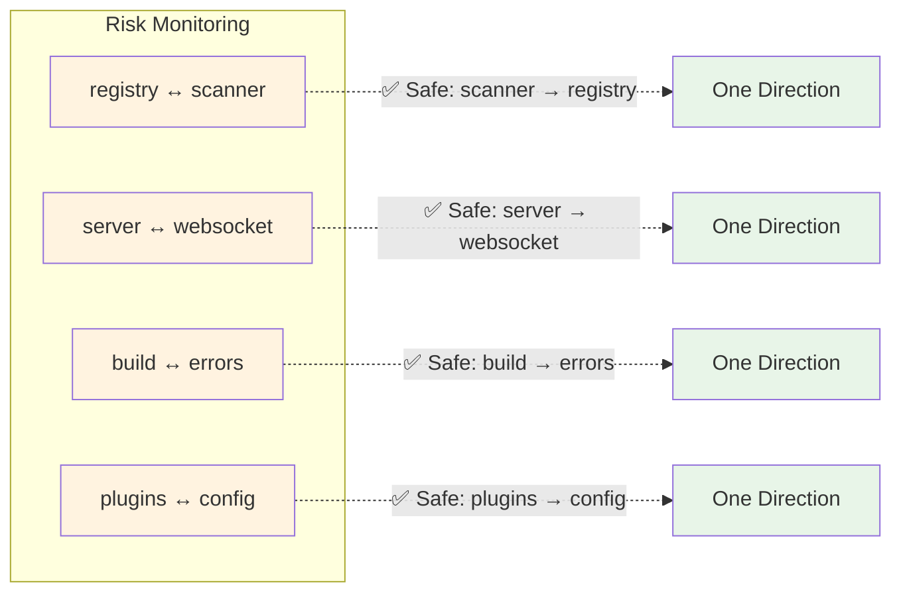

## External Dependencies

### Direct External Dependencies

```mermaid
graph TB
    subgraph "CLI & Configuration"
        COBRA[github.com/spf13/cobra]
        VIPER[github.com/spf13/viper]
        PFLAG[github.com/spf13/pflag]
    end
    
    subgraph "WebSocket & HTTP"
        WEBSOCKET[github.com/coder/websocket]
        GORILLA[github.com/gorilla/websocket]
    end
    
    subgraph "File System & Watching"
        FSNOTIFY[github.com/fsnotify/fsnotify]
    end
    
    subgraph "Testing"
        TESTIFY[github.com/stretchr/testify]
        ASSERT[github.com/stretchr/testify/assert]
        MOCK[github.com/stretchr/testify/mock]
    end
    
    subgraph "Utilities"
        UUID[github.com/google/uuid]
        YAML[gopkg.in/yaml.v3]
    end
    
    subgraph "Internal Packages Using Externals"
        CMD[cmd/] --> COBRA
        CONFIG[config/] --> VIPER
        CONFIG --> YAML
        SERVER[server/] --> WEBSOCKET
        WATCHER[watcher/] --> FSNOTIFY
        TESTUTILS[testutils/] --> TESTIFY
        TESTUTILS --> MOCK
    end
    
    classDef external fill:#ffebee
    classDef internal fill:#e8f5e8
    
    class COBRA,VIPER,PFLAG,WEBSOCKET,GORILLA,FSNOTIFY,TESTIFY,ASSERT,MOCK,UUID,YAML external
    class CMD,CONFIG,SERVER,WATCHER,TESTUTILS internal
```

### Dependency Security Analysis

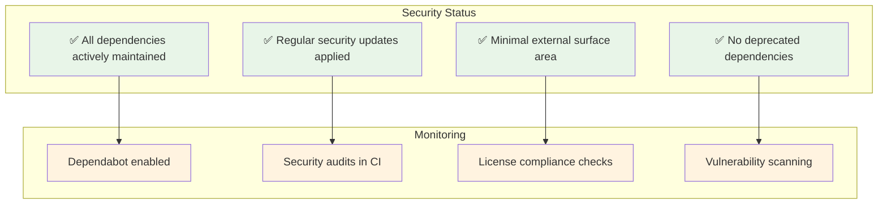

## Dependency Metrics

### Package Count by Layer

| Layer | Package Count | Percentage |
|-------|---------------|------------|
| CLI Layer | 8 packages | 20% |
| Service Layer | 3 packages | 7.5% |  
| Server/Plugin Layer | 12 packages | 30% |
| Core Business Logic | 5 packages | 12.5% |
| Infrastructure | 6 packages | 15% |
| Support/Foundation | 6 packages | 15% |

### Dependency Depth Analysis

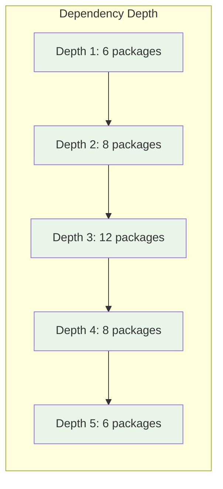

### Fan-In/Fan-Out Analysis

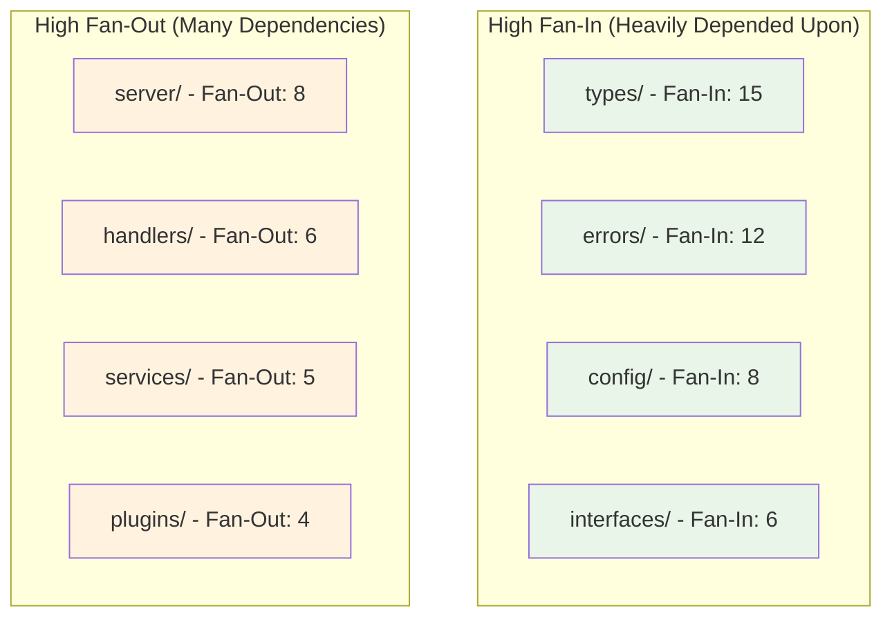

## Dependency Management Best Practices

### 1. Dependency Injection

```go
// Good: Interface-based dependency injection
type ComponentService struct {
    registry interfaces.ComponentRegistry
    scanner  interfaces.ComponentScanner
    logger   interfaces.Logger
}

// Avoid: Direct package dependencies
type ComponentService struct {
    registry *registry.ComponentRegistry
    scanner  *scanner.ComponentScanner
    logger   *logging.Logger
}
```

### 2. Factory Pattern

```go
// Use factory pattern to manage dependencies
type ServiceFactory struct {
    config *config.Config
}

func (f *ServiceFactory) CreateComponentService() *ComponentService {
    return &ComponentService{
        registry: f.createRegistry(),
        scanner:  f.createScanner(),
        logger:   f.createLogger(),
    }
}
```

### 3. Event-Driven Decoupling

```go
// Use events to avoid direct dependencies
type ComponentRegistry struct {
    eventBus interfaces.EventBus
}

func (r *ComponentRegistry) RegisterComponent(comp *types.Component) {
    // Register component
    r.components[comp.Name] = comp
    
    // Emit event instead of calling dependents directly
    r.eventBus.Emit(&events.ComponentRegistered{Component: comp})
}
```

## Maintenance Guidelines

### Regular Dependency Audits

1. **Monthly Reviews**: Check for new versions and security updates
2. **Quarterly Analysis**: Review dependency tree for optimization opportunities
3. **Annual Cleanup**: Remove unused dependencies and consolidate similar ones
4. **Security Scanning**: Continuous monitoring for vulnerabilities

### Adding New Dependencies

1. **Justification Required**: Document why the dependency is needed
2. **License Check**: Ensure compatible license
3. **Security Review**: Verify the dependency's security posture
4. **Impact Analysis**: Assess impact on build time and binary size
5. **Alternatives Evaluation**: Consider if existing dependencies can be used instead

### Dependency Update Process

1. **Automated Updates**: Use Dependabot for patch updates
2. **Manual Review**: Human review for minor and major updates
3. **Testing**: Comprehensive test suite execution
4. **Rollback Plan**: Ability to quickly revert problematic updates

---

*This documentation is maintained as part of the zero technical debt policy. Last updated: 2025-07-29*