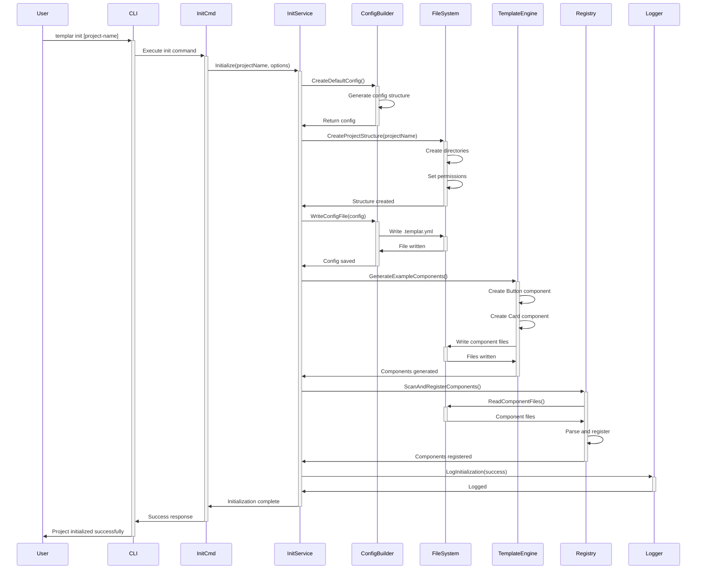
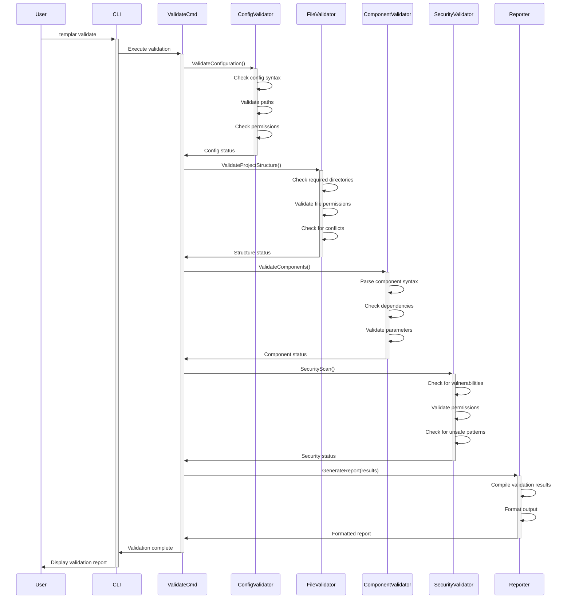
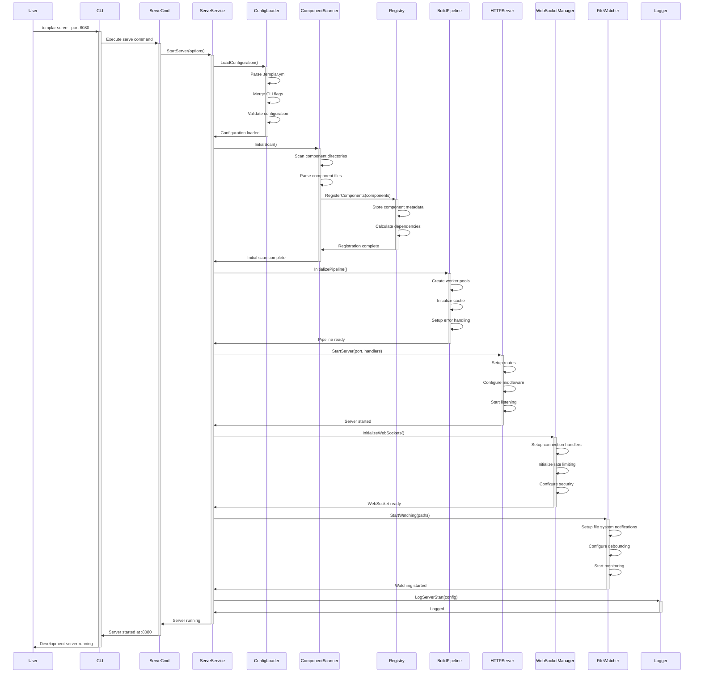

# Sequence Diagrams Documentation

This document provides detailed sequence diagrams for key workflows in the Templar system, showing the interactions between components over time.

## Table of Contents

- [Overview](#overview)
- [Project Lifecycle Workflows](#project-lifecycle-workflows)
- [Development Server Workflows](#development-server-workflows)
- [Component Management Workflows](#component-management-workflows)
- [Build System Workflows](#build-system-workflows)
- [WebSocket Communication Workflows](#websocket-communication-workflows)
- [Error Handling Workflows](#error-handling-workflows)
- [Security Workflows](#security-workflows)

## Overview

These sequence diagrams illustrate the temporal aspects of system interactions, showing how different components communicate and coordinate to achieve specific functionality.

## Project Lifecycle Workflows

### 1. Project Initialization Sequence



### 2. Project Validation Sequence



## Development Server Workflows

### 3. Server Startup Sequence



### 4. Hot Reload Sequence

```mermaid
sequenceDiagram
    participant Developer
    participant Editor
    participant FileSystem
    participant FileWatcher
    participant Debouncer
    participant ComponentScanner
    participant Registry
    participant BuildPipeline
    participant WebSocketManager
    participant Browser
    participant ErrorHandler

    Developer->>+Editor: Edit component file
    Editor->>+FileSystem: Save changes
    FileSystem->>-Editor: File saved
    Editor->>-Developer: Save complete
    
    FileSystem->>+FileWatcher: File change event
    FileWatcher->>+Debouncer: Queue change event
    Debouncer->>Debouncer: Wait for settling
    Debouncer->>-FileWatcher: Emit debounced event
    FileWatcher->>-ComponentScanner: TriggerScan(changedFile)
    
    ComponentScanner->>+FileSystem: ReadFile(changedFile)
    FileSystem->>-ComponentScanner: File content
    ComponentScanner->>ComponentScanner: Parse component
    ComponentScanner->>ComponentScanner: Extract metadata
    
    alt Parse Success
        ComponentScanner->>+Registry: UpdateComponent(component)
        Registry->>Registry: Update component info
        Registry->>Registry: Recalculate dependencies
        Registry->>-ComponentScanner: Update complete
        
        ComponentScanner->>+BuildPipeline: TriggerBuild(component)
        BuildPipeline->>BuildPipeline: Queue build task
        BuildPipeline->>BuildPipeline: Execute build
        
        alt Build Success
            BuildPipeline->>+WebSocketManager: BroadcastUpdate(component)
            WebSocketManager->>WebSocketManager: Format message
            WebSocketManager->>+Browser: Send reload message
            Browser->>Browser: Refresh component
            Browser->>-WebSocketManager: Reload complete
            WebSocketManager->>-BuildPipeline: Broadcast sent
            BuildPipeline->>-ComponentScanner: Build complete
        else Build Error
            BuildPipeline->>+ErrorHandler: HandleBuildError(error)
            ErrorHandler->>ErrorHandler: Parse error details
            ErrorHandler->>ErrorHandler: Format error message
            ErrorHandler->>+WebSocketManager: BroadcastError(error)
            WebSocketManager->>+Browser: Send error overlay
            Browser->>Browser: Display error
            Browser->>-WebSocketManager: Error displayed
            WebSocketManager->>-ErrorHandler: Error broadcast
            ErrorHandler->>-BuildPipeline: Error handled
            BuildPipeline->>-ComponentScanner: Build failed
        end
    else Parse Error
        ComponentScanner->>+ErrorHandler: HandleParseError(error)
        ErrorHandler->>+WebSocketManager: BroadcastError(error)
        WebSocketManager->>+Browser: Send syntax error
        Browser->>Browser: Display syntax error
        Browser->>-WebSocketManager: Error displayed
        WebSocketManager->>-ErrorHandler: Error broadcast
        ErrorHandler->>-ComponentScanner: Parse error handled
    end
```

## Component Management Workflows

### 5. Component Discovery Sequence

```mermaid
sequenceDiagram
    participant Scanner
    participant FileSystem
    parameter Walker as File Walker
    participant Parser
    participant MetadataExtractor
    participant HashCalculator
    participant Registry
    participant Cache
    participant Monitor

    Scanner->>+FileSystem: StartDirectoryScan(paths)
    FileSystem->>+Walker: WalkDirectories(patterns)
    
    loop For each .templ file
        Walker->>Walker: Find component file
        Walker->>+Parser: ParseFile(filePath)
        Parser->>+FileSystem: ReadFile(filePath)
        FileSystem->>-Parser: File content
        Parser->>Parser: Parse AST
        
        alt Parse Success
            Parser->>+MetadataExtractor: ExtractMetadata(ast)
            MetadataExtractor->>MetadataExtractor: Extract component name
            MetadataExtractor->>MetadataExtractor: Extract parameters
            MetadataExtractor->>MetadataExtractor: Extract dependencies
            MetadataExtractor->>MetadataExtractor: Extract imports
            MetadataExtractor->>-Parser: Metadata extracted
            
            Parser->>+HashCalculator: CalculateHash(content)
            HashCalculator->>HashCalculator: CRC32 hash
            HashCalculator->>-Parser: File hash
            
            Parser->>+Cache: CheckCache(filePath, hash)
            Cache->>-Parser: Cache status
            
            alt Cache Miss or Changed
                Parser->>+Registry: RegisterComponent(component)
                Registry->>Registry: Store component info
                Registry->>Registry: Update indexes
                Registry->>+Monitor: RecordRegistration(component)
                Monitor->>-Registry: Recorded
                Registry->>-Parser: Registration complete
                
                Parser->>+Cache: UpdateCache(filePath, hash, metadata)
                Cache->>-Parser: Cache updated
            else Cache Hit
                Parser->>Parser: Skip processing
            end
            
            Parser->>-Walker: Component processed
        else Parse Error
            Parser->>+Monitor: RecordParseError(filePath, error)
            Monitor->>-Parser: Error recorded
            Parser->>-Walker: Parse failed
        end
    end
    
    Walker->>-FileSystem: Scan complete
    FileSystem->>-Scanner: Discovery complete
    
    Scanner->>+Monitor: RecordScanComplete(stats)
    Monitor->>-Scanner: Stats recorded
```

### 6. Component Build Sequence

```mermaid
sequenceDiagram
    participant BuildService
    participant TaskQueue
    participant WorkerPool
    parameter W1 as Worker 1
    parameter W2 as Worker 2
    parameter W3 as Worker 3
    participant Cache
    participant TemplCompiler
    participant ErrorCollector
    participant Monitor

    BuildService->>+TaskQueue: QueueBuildTasks(components)
    TaskQueue->>TaskQueue: Prioritize tasks
    TaskQueue->>TaskQueue: Distribute to workers
    TaskQueue->>+WorkerPool: StartProcessing()
    
    par Worker 1 Processing
        WorkerPool->>+W1: ProcessTask(component1)
        W1->>+Cache: CheckBuildCache(component1)
        Cache->>-W1: Cache miss
        W1->>+TemplCompiler: CompileComponent(component1)
        TemplCompiler->>TemplCompiler: Generate Go code
        TemplCompiler->>-W1: Compilation result
        W1->>+Cache: StoreBuildResult(component1, result)
        Cache->>-W1: Cached
        W1->>+Monitor: RecordBuildSuccess(component1, duration)
        Monitor->>-W1: Recorded
        W1->>-WorkerPool: Task complete
    and Worker 2 Processing
        WorkerPool->>+W2: ProcessTask(component2)
        W2->>+Cache: CheckBuildCache(component2)
        Cache->>-W2: Cache hit
        W2->>+Monitor: RecordCacheHit(component2)
        Monitor->>-W2: Recorded
        W2->>-WorkerPool: Task complete (cached)
    and Worker 3 Processing
        WorkerPool->>+W3: ProcessTask(component3)
        W3->>+Cache: CheckBuildCache(component3)
        Cache->>-W3: Cache miss
        W3->>+TemplCompiler: CompileComponent(component3)
        TemplCompiler->>TemplCompiler: Compilation error
        TemplCompiler->>-W3: Error result
        W3->>+ErrorCollector: CollectError(component3, error)
        ErrorCollector->>ErrorCollector: Parse error details
        ErrorCollector->>ErrorCollector: Add context
        ErrorCollector->>-W3: Error processed
        W3->>+Monitor: RecordBuildError(component3, error)
        Monitor->>-W3: Recorded
        W3->>-WorkerPool: Task failed
    end
    
    WorkerPool->>+TaskQueue: AllTasksComplete()
    TaskQueue->>+ErrorCollector: GetCollectedErrors()
    ErrorCollector->>-TaskQueue: Error summary
    TaskQueue->>-WorkerPool: Processing complete
    WorkerPool->>-BuildService: Build complete
    
    alt Build Success
        BuildService->>+Monitor: RecordBuildSuccess(stats)
        Monitor->>-BuildService: Recorded
    else Build Errors
        BuildService->>+Monitor: RecordBuildFailure(errors)
        Monitor->>-BuildService: Recorded
    end
```

## WebSocket Communication Workflows

### 7. WebSocket Connection Sequence

```mermaid
sequenceDiagram
    participant Browser
    participant HTTPServer
    participant WebSocketManager
    participant SecurityValidator
    participant RateLimiter
    participant ConnectionPool
    participant EventBus
    participant Registry

    Browser->>+HTTPServer: HTTP Upgrade Request
    HTTPServer->>+WebSocketManager: HandleUpgrade(request)
    
    WebSocketManager->>+SecurityValidator: ValidateOrigin(request)
    SecurityValidator->>SecurityValidator: Check allowed origins
    SecurityValidator->>SecurityValidator: Validate scheme
    SecurityValidator->>SecurityValidator: Check headers
    
    alt Security Valid
        SecurityValidator->>-WebSocketManager: Origin validated
        
        WebSocketManager->>+RateLimiter: CheckConnectionLimit(clientIP)
        RateLimiter->>RateLimiter: Check current connections
        RateLimiter->>RateLimiter: Apply rate limits
        
        alt Rate Limit OK
            RateLimiter->>-WebSocketManager: Connection allowed
            
            WebSocketManager->>WebSocketManager: Upgrade connection
            WebSocketManager->>+ConnectionPool: AddConnection(websocket)
            ConnectionPool->>ConnectionPool: Generate client ID
            ConnectionPool->>ConnectionPool: Store connection
            ConnectionPool->>-WebSocketManager: Connection added
            
            WebSocketManager->>+EventBus: Subscribe(clientID, events)
            EventBus->>EventBus: Add subscription
            EventBus->>-WebSocketManager: Subscribed
            
            WebSocketManager->>+Registry: GetCurrentState()
            Registry->>-WebSocketManager: Component list
            
            WebSocketManager->>+Browser: Send initial state
            Browser->>Browser: Initialize client state
            Browser->>-WebSocketManager: State received
            
            WebSocketManager->>-HTTPServer: Connection established
            HTTPServer->>-Browser: WebSocket connected
            
            loop Message Processing
                Browser->>+WebSocketManager: Send message
                WebSocketManager->>+RateLimiter: CheckMessageRate(clientID)
                RateLimiter->>-WebSocketManager: Rate OK
                WebSocketManager->>WebSocketManager: Process message
                WebSocketManager->>-Browser: Send response
            end
            
        else Rate Limited
            RateLimiter->>-WebSocketManager: Rate limited
            WebSocketManager->>WebSocketManager: Reject connection
            WebSocketManager->>-HTTPServer: Connection rejected
            HTTPServer->>-Browser: 429 Too Many Requests
        end
        
    else Security Invalid
        SecurityValidator->>-WebSocketManager: Origin rejected
        WebSocketManager->>WebSocketManager: Reject connection
        WebSocketManager->>-HTTPServer: Security violation
        HTTPServer->>-Browser: 403 Forbidden
    end
```

### 8. Real-time Update Broadcasting Sequence

```mermaid
sequenceDiagram
    participant Registry
    participant EventBus
    participant WebSocketManager
    participant ConnectionPool
    participant RateLimiter
    parameter C1 as Client 1
    parameter C2 as Client 2
    parameter C3 as Client 3
    participant ErrorHandler

    Registry->>+EventBus: EmitEvent(ComponentUpdated)
    EventBus->>EventBus: Get subscribers
    EventBus->>+WebSocketManager: BroadcastEvent(event, subscribers)
    
    WebSocketManager->>WebSocketManager: Format message
    WebSocketManager->>+ConnectionPool: GetActiveConnections()
    ConnectionPool->>-WebSocketManager: Connection list
    
    par Broadcast to Client 1
        WebSocketManager->>+RateLimiter: CheckBroadcastRate(client1)
        RateLimiter->>-WebSocketManager: Rate OK
        WebSocketManager->>+C1: Send update message
        C1->>C1: Process update
        C1->>-WebSocketManager: ACK received
        WebSocketManager->>WebSocketManager: Mark success
    and Broadcast to Client 2
        WebSocketManager->>+RateLimiter: CheckBroadcastRate(client2)
        RateLimiter->>-WebSocketManager: Rate limited
        WebSocketManager->>WebSocketManager: Queue for retry
    and Broadcast to Client 3
        WebSocketManager->>+RateLimiter: CheckBroadcastRate(client3)
        RateLimiter->>-WebSocketManager: Rate OK
        WebSocketManager->>+C3: Send update message
        C3->>C3: Connection error
        C3->>-WebSocketManager: Connection failed
        WebSocketManager->>+ErrorHandler: HandleDeadConnection(client3)
        ErrorHandler->>+ConnectionPool: RemoveConnection(client3)
        ConnectionPool->>-ErrorHandler: Connection removed
        ErrorHandler->>-WebSocketManager: Cleanup complete
    end
    
    WebSocketManager->>WebSocketManager: Process broadcast results
    WebSocketManager->>+EventBus: BroadcastComplete(stats)
    EventBus->>-WebSocketManager: Stats recorded
    WebSocketManager->>-EventBus: Broadcast finished
    EventBus->>-Registry: Event processed
```

## Error Handling Workflows

### 9. Error Handling and Recovery Sequence

```mermaid
sequenceDiagram
    participant Component
    participant ErrorHandler
    participant ErrorClassifier
    participant ErrorReporter
    participant Logger
    participant Monitor
    participant RecoveryManager
    participant User

    Component->>+ErrorHandler: HandleError(error, context)
    ErrorHandler->>+ErrorClassifier: ClassifyError(error)
    ErrorClassifier->>ErrorClassifier: Analyze error type
    ErrorClassifier->>ErrorClassifier: Determine severity  
    ErrorClassifier->>ErrorClassifier: Extract context
    ErrorClassifier->>-ErrorHandler: Error classification
    
    alt Critical Error
        ErrorHandler->>+Logger: LogCriticalError(error, context)
        Logger->>Logger: Write to error log
        Logger->>Logger: Send to monitoring
        Logger->>-ErrorHandler: Logged
        
        ErrorHandler->>+Monitor: RecordCriticalError(error)
        Monitor->>Monitor: Update error metrics
        Monitor->>Monitor: Trigger alerts
        Monitor->>-ErrorHandler: Recorded
        
        ErrorHandler->>+RecoveryManager: AttemptRecovery(error)
        RecoveryManager->>RecoveryManager: Identify recovery strategy
        RecoveryManager->>RecoveryManager: Execute recovery
        
        alt Recovery Success
            RecoveryManager->>+Logger: LogRecovery(strategy, success)
            Logger->>-RecoveryManager: Logged
            RecoveryManager->>-ErrorHandler: Recovery successful
            
            ErrorHandler->>+ErrorReporter: ReportRecovery(error, recovery)
            ErrorReporter->>-ErrorHandler: Recovery reported
            
        else Recovery Failed
            RecoveryManager->>+Logger: LogRecoveryFailure(strategy, error)
            Logger->>-RecoveryManager: Logged
            RecoveryManager->>-ErrorHandler: Recovery failed
            
            ErrorHandler->>+ErrorReporter: ReportSystemFailure(error)
            ErrorReporter->>+User: Display critical error
            User->>-ErrorReporter: Error acknowledged
            ErrorReporter->>-ErrorHandler: Error reported
        end
        
    else Recoverable Error
        ErrorHandler->>+Logger: LogError(error, context)
        Logger->>-ErrorHandler: Logged
        
        ErrorHandler->>+ErrorReporter: ReportError(error)
        ErrorReporter->>+User: Display error message
        User->>-ErrorReporter: Error seen
        ErrorReporter->>-ErrorHandler: Error reported
        
    else Warning
        ErrorHandler->>+Logger: LogWarning(error, context)
        Logger->>-ErrorHandler: Logged
        
        ErrorHandler->>+Monitor: RecordWarning(error)
        Monitor->>-ErrorHandler: Recorded
    end
    
    ErrorHandler->>-Component: Error handled
```

## Security Workflows

### 10. Security Validation Sequence

```mermaid
sequenceDiagram
    participant Request
    participant SecurityGateway
    participant InputValidator
    participant PathValidator
    participant CommandValidator
    participant RateLimiter
    participant AuditLogger
    participant ErrorHandler

    Request->>+SecurityGateway: IncomingRequest(data)
    SecurityGateway->>+InputValidator: ValidateInput(data)
    
    InputValidator->>InputValidator: Check for XSS patterns
    InputValidator->>InputValidator: Validate encoding
    InputValidator->>InputValidator: Check input length
    InputValidator->>InputValidator: Sanitize input
    
    alt Input Valid
        InputValidator->>-SecurityGateway: Input validated
        
        SecurityGateway->>+PathValidator: ValidatePaths(paths)
        PathValidator->>PathValidator: Check for path traversal
        PathValidator->>PathValidator: Validate directory bounds
        PathValidator->>PathValidator: Check permissions
        
        alt Paths Valid
            PathValidator->>-SecurityGateway: Paths validated
            
            SecurityGateway->>+CommandValidator: ValidateCommands(commands)
            CommandValidator->>CommandValidator: Check against allowlist
            CommandValidator->>CommandValidator: Validate arguments
            CommandValidator->>CommandValidator: Check for injection
            
            alt Commands Valid
                CommandValidator->>-SecurityGateway: Commands validated
                
                SecurityGateway->>+RateLimiter: CheckRateLimit(client)
                RateLimiter->>RateLimiter: Check request rate
                RateLimiter->>RateLimiter: Update counters
                
                alt Rate Limit OK
                    RateLimiter->>-SecurityGateway: Request allowed
                    
                    SecurityGateway->>+AuditLogger: LogSecurityEvent(request, success)
                    AuditLogger->>-SecurityGateway: Event logged
                    
                    SecurityGateway->>-Request: Security validation passed
                    
                else Rate Limited
                    RateLimiter->>-SecurityGateway: Rate limited
                    
                    SecurityGateway->>+AuditLogger: LogSecurityEvent(request, rate_limited)
                    AuditLogger->>-SecurityGateway: Event logged
                    
                    SecurityGateway->>+ErrorHandler: HandleRateLimit(client)
                    ErrorHandler->>-SecurityGateway: Rate limit response
                    
                    SecurityGateway->>-Request: 429 Too Many Requests
                end
                
            else Commands Invalid
                CommandValidator->>-SecurityGateway: Command injection detected
                
                SecurityGateway->>+AuditLogger: LogSecurityEvent(request, command_injection)
                AuditLogger->>-SecurityGateway: Security violation logged
                
                SecurityGateway->>+ErrorHandler: HandleSecurityViolation(request, command_injection)
                ErrorHandler->>-SecurityGateway: Security response
                
                SecurityGateway->>-Request: 403 Forbidden
            end
            
        else Paths Invalid
            PathValidator->>-SecurityGateway: Path traversal detected
            
            SecurityGateway->>+AuditLogger: LogSecurityEvent(request, path_traversal)
            AuditLogger->>-SecurityGateway: Security violation logged
            
            SecurityGateway->>+ErrorHandler: HandleSecurityViolation(request, path_traversal)
            ErrorHandler->>-SecurityGateway: Security response
            
            SecurityGateway->>-Request: 403 Forbidden
        end
        
    else Input Invalid
        InputValidator->>-SecurityGateway: XSS attempt detected
        
        SecurityGateway->>+AuditLogger: LogSecurityEvent(request, xss_attempt)
        AuditLogger->>-SecurityGateway: Security violation logged
        
        SecurityGateway->>+ErrorHandler: HandleSecurityViolation(request, xss_attempt)
        ErrorHandler->>-SecurityGateway: Security response
        
        SecurityGateway->>-Request: 400 Bad Request
    end
```

## Performance Optimization Workflows

### 11. Performance Monitoring Sequence

```mermaid
sequenceDiagram
    participant Operation
    participant PerformanceMonitor
    participant MetricsCollector
    participant StatisticsEngine
    participant RegressionDetector
    participant AlertManager
    participant Dashboard

    Operation->>+PerformanceMonitor: StartOperation(operationType)
    PerformanceMonitor->>PerformanceMonitor: Record start time
    PerformanceMonitor->>PerformanceMonitor: Initialize counters
    PerformanceMonitor->>-Operation: Monitoring started
    
    Operation->>Operation: Execute operation
    
    loop During Operation
        Operation->>+MetricsCollector: RecordMetric(name, value)
        MetricsCollector->>MetricsCollector: Store metric
        MetricsCollector->>-Operation: Metric recorded
    end
    
    Operation->>+PerformanceMonitor: EndOperation(result)
    PerformanceMonitor->>PerformanceMonitor: Calculate duration
    PerformanceMonitor->>PerformanceMonitor: Record final metrics
    
    PerformanceMonitor->>+MetricsCollector: StoreOperationMetrics(metrics)
    MetricsCollector->>MetricsCollector: Persist metrics
    MetricsCollector->>+StatisticsEngine: UpdateStatistics(metrics)
    StatisticsEngine->>StatisticsEngine: Calculate moving averages
    StatisticsEngine->>StatisticsEngine: Update percentiles
    StatisticsEngine->>StatisticsEngine: Compute trends
    StatisticsEngine->>-MetricsCollector: Statistics updated
    MetricsCollector->>-PerformanceMonitor: Metrics stored
    
    PerformanceMonitor->>+RegressionDetector: CheckForRegression(metrics)
    RegressionDetector->>RegressionDetector: Compare with baseline
    RegressionDetector->>RegressionDetector: Apply statistical tests
    RegressionDetector->>RegressionDetector: Calculate confidence intervals
    
    alt Regression Detected
        RegressionDetector->>+AlertManager: TriggerRegressionAlert(regression)
        AlertManager->>AlertManager: Format alert
        AlertManager->>AlertManager: Send notifications
        AlertManager->>-RegressionDetector: Alert sent
        RegressionDetector->>-PerformanceMonitor: Regression reported
    else No Regression
        RegressionDetector->>-PerformanceMonitor: Performance normal
    end
    
    PerformanceMonitor->>+Dashboard: UpdateDashboard(metrics)
    Dashboard->>Dashboard: Refresh charts
    Dashboard->>Dashboard: Update indicators
    Dashboard->>-PerformanceMonitor: Dashboard updated
    
    PerformanceMonitor->>-Operation: Monitoring complete
```

---

*These sequence diagrams provide detailed views of the temporal interactions in the Templar system. They should be updated whenever significant changes are made to the corresponding workflows. Last updated: 2025-07-29*